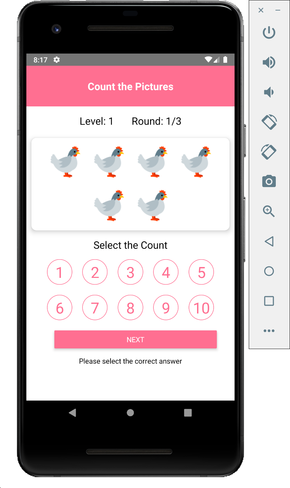

# Count Pictures Game for Kids

## Developement Environment
React Native

## How to build & Run
How to Build the app?
* Install NodeJS 
* Install React Native and it's pre-requisites
* Install react native cli 
* Install Android SDK (for Android)
* Install XCode tools on MAC (for iOS)
* run "npm install"
* Run on Android
    * Connect the device or start emulator 
    * run "react-native run-android" (for Android)
* Run on iOS
    * Start Simulator / connec the device
    * run "react-native run-iOS"

## How to generate APK for Android?
* Follow the steps below
    * Creating a Private Signing Key
    * To generate APK you need to have Private Signing Key
    * Run "keytool -genkey -v -keystore my-key.keystore -alias my-key-alias -keyalg RSA -keysize 2048 -validity 10000" to generate the keystore
    * Provide the required details like Name, organization, Country
    * set Keystore and Alias key password, save the keystore and alis passwords
* Adding Keystore to your project
    * Now, you have to place the created keystore file under the android/app directory in your react native project folder
    * Update your release store password and release key password in gradle.properties
        MYAPP_RELEASE_STORE_PASSWORD=******
        MYAPP_RELEASE_KEY_PASSWORD=*******
* Generating APK
    * Open terminal or command prompt and navigate to "android" directory
    * Run the following commands
        * For windows, gradlew assembleRelease
        * For Linux, ./gradlew assembleRelease

Now the APK creation process is done! You can find the generated APK at android/app/build/outputs/apk/app-release.apk

